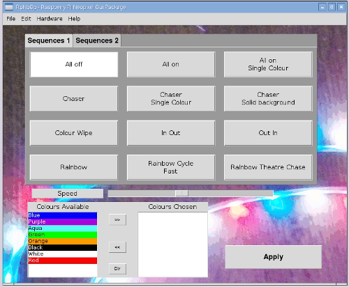

# neopixel-gui customisation guide

## About the neopixel GUI

The Neopixel GUI application is a simple graphical interface for controlling neopixel RGB LEDs on a Raspberry Pi. 

The software includes a number of pre-programmed sequences that provide a variety of different effects. This guide provides details of how additional sequences can be added to the application.

## Installing neopixel GUI

For information on installing and initial configuration of the application see the README.md and INSTALL.md files. There is also a user guide explaining how to use the GUI.

## WARNING

The customisations listed in this guide include changes to the program code files. This means that:

*Any errors can stop the application from running.
*Files will be overwritten in future versions.

To provide protection against breaking a working application I suggest that you backup all files before making any changes. This includes the neopixelseq.py and the sequences.cfg file.

The two files mentioned above are considered part of the main application so will be overwritten by any upgrades. *Before upgrading* make sure that you have created a backup of any changes that you have made to the file.

If you have created a new sequence that you think would be useful for other users then please consider adding it to the main code through a github fork (details later), or by contacting me with the details through the contact form on my website.

## Changing the colours

## Changing the order and disabling sequences

## Adding new custom sequences

## Further information

See the user guide for more information on using the application.

More information will also be provided on [www.penguintutor.com](http://www.penguintutor.com)
